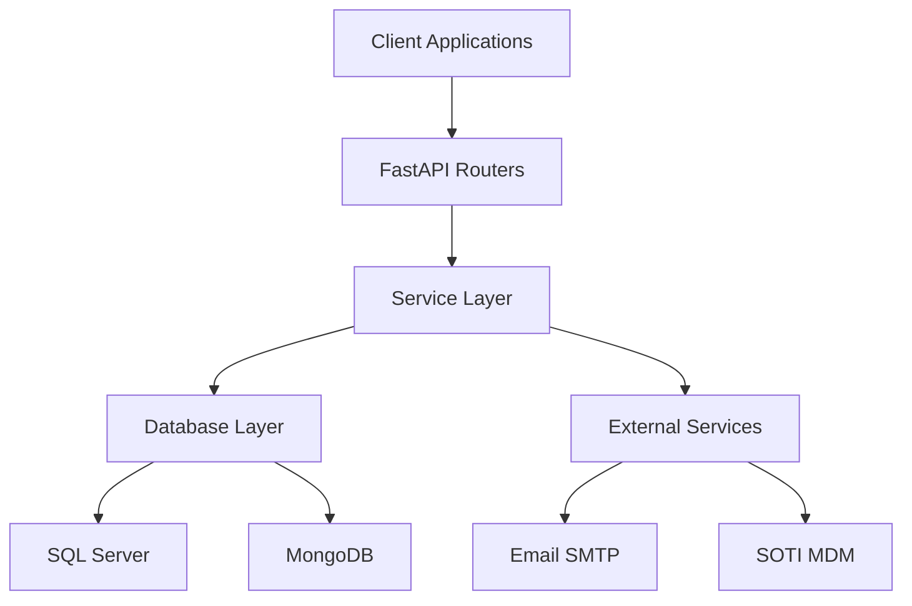

## Overview

The Solicitud Transporte API is built using a modern, layered architecture pattern that separates concerns and enables maintainability and scalability. The system manages transportation requests and missions for the ONI Justicia organization.


## Technology Stack

<CardGroup cols={3}>
  <Card title="FastAPI" icon="bolt">
    Modern Python web framework for building APIs with automatic OpenAPI documentation
  </Card>
  <Card title="SQL Server" icon="database">
    Primary relational database for transactional data using pymssql driver
  </Card>
  <Card title="MongoDB" icon="leaf">
    NoSQL database for logging and flexible document storage using pymongo
  </Card>
</CardGroup>

## Application Layers

The application follows a clean, layered architecture:



### 1. Router Layer (`routers/`)

The router layer handles HTTP requests and responses. Each router corresponds to a specific resource or domain entity.

<Accordion title="Key Responsibilities">
  - Request validation using Pydantic models
  - HTTP endpoint definition and routing
  - Response formatting and status codes
  - Authentication and authorization (future)
</Accordion>

**Example routers:**
- `solicitud_router.py` - Transport request management (main.py:31)
- `mision_router.py` - Mission operations (main.py:33)
- `vehiculo_router.py` - Vehicle catalog (main.py:29)
- `motorista_router.py` - Driver management (main.py:30)

### 2. Service Layer (`services/`)

The service layer contains the business logic and orchestrates operations across multiple data sources.

<CodeGroup>
```python services/base_service.py
class BaseService:
    """Base class for all services"""
    
    def __init__(self):
        self.db = get_sql_manager()
    
    def _serializar_valor(self, valor: Any) -> Any:
        """Converts Python types to JSON-serializable formats"""
        # Handles datetime, date, time, Decimal, bytes
        pass
```

```python services/solicitud_service.py
class SolicitudService(BaseService):
    """Request service with approval workflow"""
    
    def crear(self, datos: Dict) -> Dict:
        """Creates new transport request"""
        # 1. Validate foreign keys
        # 2. Generate request code
        # 3. Insert into database
        # 4. Register initial state
        # 5. Send notification emails
        pass
```
</CodeGroup>

<Note>
  All services inherit from `BaseService` which provides common utilities for database access and data serialization (services/base_service.py:14)
</Note>

### 3. Database Layer (`database/`)

Provides abstraction for database operations with connection pooling and error handling.

<Tabs>
  <Tab title="SQL Server">
    **File:** `database/sql_connection.py`
    
    The `SQLServerManager` class provides:
    - Connection pooling via context managers (sql_connection.py:68)
    - Parameterized queries to prevent SQL injection (sql_connection.py:107)
    - Automatic commit/rollback handling (sql_connection.py:184)
    - CRUD helper methods (sql_connection.py:346)
    
    ```python
    # Connection configuration from config.py
    server = settings.sqlserver.HOST
    port = settings.sqlserver.PORT  # Default: 1433
    database = settings.sqlserver.NAME
    ```
  </Tab>
  
  <Tab title="MongoDB">
    **File:** `database/mongo_client.py`
    
    MongoDB client for logging and analytics:
    - Persistent connection with connection pooling (mongo_client.py:29)
    - CRUD operations with aggregation support (mongo_client.py:319)
    - Configurable via environment variables (mongo_client.py:25)
    
    ```python
    # Initialized on first access
    def get_db():
        if _db is None:
            init_mongo()
        return _db
    ```
  </Tab>
</Tabs>

### 4. Model Layer (`models/`)

Pydantic models define the data structure and validation rules for API requests and responses.

<CardGroup cols={2}>
  <Card title="Request Models" icon="arrow-right">
    - `EstadoSolicitudCreate` (estado_solicitud_model.py:16)
    - `EstadoSolicitudUpdate` (estado_solicitud_model.py:92)
    - Validation decorators for business rules
  </Card>
  <Card title="Response Models" icon="arrow-left">
    - `EstadoSolicitudResponse` (estado_solicitud_model.py:133)
    - `EstadoSolicitudListResponse` (estado_solicitud_model.py:151)
    - Automatic serialization of database types
  </Card>
</CardGroup>

## Database Design

The system uses a normalized relational database schema with the following key tables:

### Core Tables

<AccordionGroup>
  <Accordion title="Solicitud (Transport Requests)">
    Primary table for transportation requests (DevSolicitudTransporte:372)
    
    **Key Fields:**
    - `CodigoSolicitud` - Auto-generated code (SOL-YYYY-MM-########)
    - `IdUsuarioSolicitante` - Requesting user
    - `IdDepartamentoSolicitante` - Requesting department
    - `IdUsuarioAprobador` - Approving authority
    - `FechaServicioRequerido` - Required service date
    - `HoraServicioRequerido` - Required service time
    - `IdEstadoSolicitud` - Current state (FK)
    
    **Relationships:**
    - One-to-many with `Mision` (missions)
    - One-to-many with `HistoricoEstadoSolicitud` (state history)
    - One-to-many with `DetalleLugarSolicitud` (locations)
  </Accordion>
  
  <Accordion title="Mision (Missions)">
    Represents actual transportation assignments (DevSolicitudTransporte:523)
    
    **Key Fields:**
    - `IdSolicitud` - Parent request
    - `IdVehiculoAsignado` - Assigned vehicle
    - `IdMotoristaAsignado` - Assigned driver
    - `IdLugarOrigen` / `IdLugarDestino` - Origin/destination
    - `FechaProgramada` - Scheduled date
    - `KilometrajeInicio` / `KilometrajeFin` - Odometer readings
    - `CombustibleConsumidoGalones` - Fuel consumption
  </Accordion>
  
  <Accordion title="EstadoSolicitud (Request States)">
    Catalog of possible request states (DevSolicitudTransporte:35)
    
    **Key Fields:**
    - `Codigo` - Unique state code (e.g., PENDIENTE_APROBACION)
    - `Nombre` - Display name
    - `Color` - UI color representation
    - `EsEstadoFinal` - Whether this is a terminal state
    - `Orden` - Display order in workflow
  </Accordion>
  
  <Accordion title="EstadoMision (Mission States)">
    Catalog of possible mission states (DevSolicitudTransporte:18)
    
    **Key Fields:**
    - `Codigo` - Unique state code (e.g., PROGRAMADA, EN_EJECUCION)
    - `Nombre` - Display name
    - `Descripcion` - State description
  </Accordion>
</AccordionGroup>

### Supporting Tables

- **Vehiculo** - Vehicle catalog with maintenance tracking (DevSolicitudTransporte:477)
- **Perfil** - User profiles linked to Usuario table (DevSolicitudTransporte:208)
- **Departamento** - Organizational departments (DevSolicitudTransporte:252)
- **Lugares** - Location registry with GPS coordinates (DevSolicitudTransporte:73)

## Configuration Management

The application uses environment variables for configuration, loaded via `config.py`:

<CodeGroup>
```python SQL Server Configuration
class SQLServerConfig:
    ENGINE = os.getenv('SQL_ENGINE', 'mssql')
    HOST = os.getenv('SQL_HOST', 'localhost')
    PORT = int(os.getenv('SQL_PORT', '1433'))
    NAME = os.getenv('SQL_NAME', '')
    USER = os.getenv('SQL_USER', '')
    PASSWORD = os.getenv('SQL_PASSWORD', '')
```

```python MongoDB Configuration
class MongoDBConfig:
    URL = os.getenv('DB_URL')  # Full connection string
    HOST = os.getenv('DB_HOST', 'localhost')
    PORT = int(os.getenv('DB_PORT', '27017'))
    NAME = os.getenv('DB_NAME', 'dev_oni_justicia')
    USER = os.getenv('DB_USER', 'admin')
    PASSWORD = os.getenv('DB_PASSWORD', '')
```

```python Application Settings
class AppConfig:
    TITLE = os.getenv('API_TITLE', 'Backend ONI Justicia')
    VERSION = os.getenv('API_VERSION', '1.0.0')
    DEBUG = os.getenv('API_DEBUG', 'false').lower() == 'true'
    LOG_LEVEL = os.getenv('API_LOG_LEVEL', 'INFO')
    TIMEZONE = os.getenv('TIMEZONE', 'America/El_Salvador')
```
</CodeGroup>

<Warning>
  The `config.py` module validates critical configuration on import and emits warnings for missing values (config.py:187)
</Warning>

## Middleware & Error Handling

The application implements several middleware components:

### CORS Middleware

Configured to allow all origins for development (main.py:57):

```python
app.add_middleware(
    CORSMiddleware,
    allow_origins=["*"],
    allow_credentials=True,
    allow_methods=["*"],
    allow_headers=["*"],
)
```

### Global Exception Handlers

<Steps>
  <Step title="Validation Errors">
    Custom handler translates Pydantic validation errors to Spanish (main.py:70)
  </Step>
  <Step title="Unhandled Exceptions">
    Global exception handler catches all unhandled errors (main.py:127)
  </Step>
  <Step title="Response Standardization">
    All responses follow a consistent format via `response_handler.py`
  </Step>
</Steps>

## Folder Structure

```
source/
├── main.py                 # Application entry point
├── config.py               # Configuration management
├── requirements.txt        # Python dependencies
├── routers/               # HTTP endpoint definitions
│   ├── solicitud_router.py
│   ├── mision_router.py
│   ├── vehiculo_router.py
│   └── ...
├── services/              # Business logic layer
│   ├── base_service.py
│   ├── solicitud_service.py
│   ├── mision_service.py
│   └── ...
├── models/                # Pydantic schemas
│   ├── estado_solicitud_model.py
│   ├── estado_mision_model.py
│   └── ...
├── database/              # Database abstraction
│   ├── sql_connection.py  # SQL Server manager
│   └── mongo_client.py    # MongoDB client
├── utils/                 # Utility modules
│   ├── response_handler.py
│   ├── logging_config.py
│   └── validaciones.py
└── templates/             # Email templates
    └── email/
```

## Design Patterns

<CardGroup cols={2}>
  <Card title="Singleton Pattern" icon="1">
    Database managers use singleton pattern to reuse connections (sql_connection.py:501)
  </Card>
  <Card title="Repository Pattern" icon="2">
    Service layer abstracts data access from business logic
  </Card>
  <Card title="Dependency Injection" icon="3">
    Configuration injected via `get_settings()` function (config.py:197)
  </Card>
  <Card title="Context Manager" icon="4">
    Database connections managed with Python context managers (sql_connection.py:68)
  </Card>
</CardGroup>

<Note>
  The architecture supports horizontal scaling by using connection pooling and stateless service design.
</Note>

## Next Steps

<CardGroup cols={2}>
  <Card title="Workflow States" icon="diagram-project" href="/concepts/workflow">
    Learn about request and mission state transitions
  </Card>
  <Card title="Error Handling" icon="triangle-exclamation" href="/concepts/error-handling">
    Understand error responses and validation
  </Card>
</CardGroup>