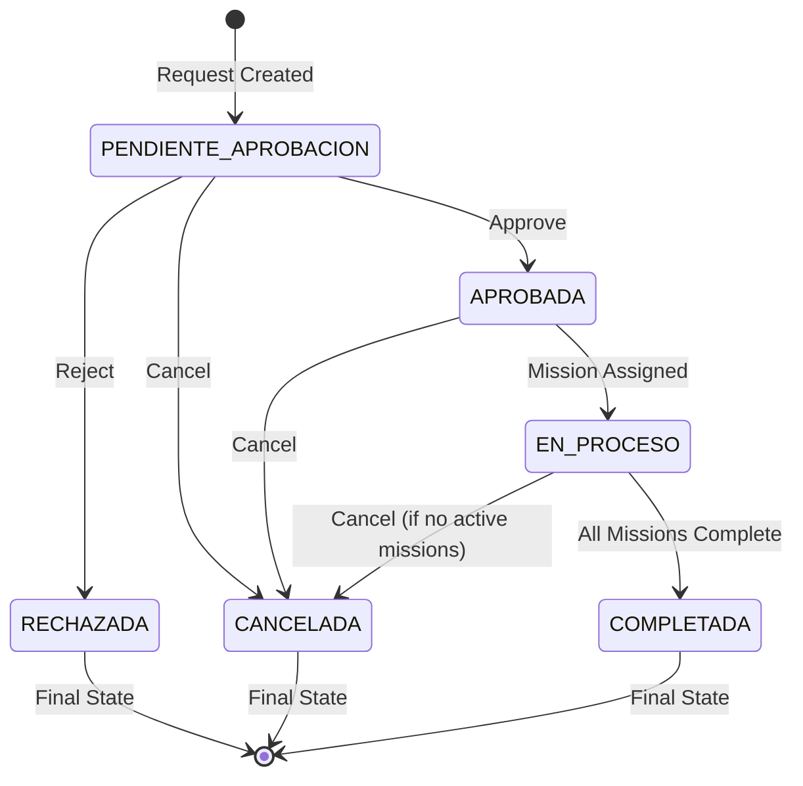
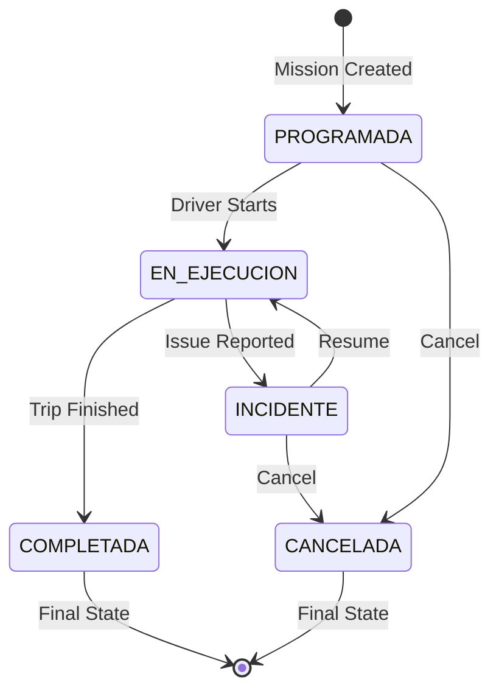
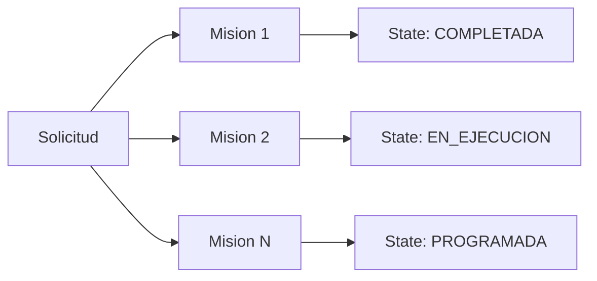

## Overview

The Solicitud Transporte system manages two parallel workflows: **Transport Requests (Solicitud)** and **Missions (Mision)**. Each has its own state machine with specific transition rules and business logic.

<Info>
  All state transitions are tracked in historical tables for audit purposes and can be retrieved via dedicated endpoints.
</Info>

## Request Lifecycle

A transport request flows through several states from creation to completion.

### State Diagram



### Request States

The `EstadoSolicitud` table defines all possible states with specific attributes (DevSolicitudTransporte:35):

<AccordionGroup>
  <Accordion title="PENDIENTE_APROBACION (Pending Approval)">
    **Description:** Initial state when a request is created
    
    **Characteristics:**
    - `EsEstadoFinal`: `false`
    - `Orden`: 1
    - Default color: Orange/Yellow
    
    **Allowed Operations:**
    - Update request details (solicitud_service.py:609)
    - Approve request (solicitud_service.py:703)
    - Reject request (solicitud_service.py:752)
    - Cancel request (solicitud_service.py:805)
    - Delete request (solicitud_service.py:932)
    
    **Business Rules:**
    - Only the requester can update or cancel
    - Only the approver can approve or reject
    - Requester and approver must be different people (solicitud_service.py:314)
  </Accordion>
  
  <Accordion title="APROBADA (Approved)">
    **Description:** Request has been approved and awaits mission assignment
    
    **Characteristics:**
    - `EsEstadoFinal`: `false`
    - `Orden`: 2
    - Default color: Green
    
    **Allowed Operations:**
    - Create missions for this request
    - Cancel request (solicitud_service.py:805)
    
    **Automatic Transitions:**
    - → `EN_PROCESO` when first mission is assigned
    - → `CANCELADA` via cancel operation
    
    **Notifications:**
    - Email sent to requester confirming approval
  </Accordion>
  
  <Accordion title="RECHAZADA (Rejected)">
    **Description:** Request was rejected by approver
    
    **Characteristics:**
    - `EsEstadoFinal`: `true`
    - `Orden`: 3
    - Default color: Red
    
    **Business Rules:**
    - Rejection reason is mandatory (solicitud_service.py:761)
    - No further operations allowed
    - Historical record preserved (solicitud_service.py:108)
    
    **Notifications:**
    - Email sent to requester with rejection reason
  </Accordion>
  
  <Accordion title="EN_PROCESO (In Progress)">
    **Description:** One or more missions are active
    
    **Characteristics:**
    - `EsEstadoFinal`: `false`
    - `Orden`: 4
    - Default color: Blue
    
    **Allowed Operations:**
    - View mission status
    - Cancel request (only if no missions are currently executing)
    
    **Automatic Transitions:**
    - → `COMPLETADA` when all missions reach final state
  </Accordion>
  
  <Accordion title="COMPLETADA (Completed)">
    **Description:** All missions completed successfully
    
    **Characteristics:**
    - `EsEstadoFinal`: `true`
    - `Orden`: 5
    - Default color: Dark Green
    
    **Business Rules:**
    - No modifications allowed
    - All associated missions must be in final state
    - Historical data retained indefinitely
  </Accordion>
  
  <Accordion title="CANCELADA (Cancelled)">
    **Description:** Request was cancelled
    
    **Characteristics:**
    - `EsEstadoFinal`: `true`
    - `Orden`: 6
    - Default color: Gray
    
    **Business Rules:**
    - Cancellation reason is mandatory (solicitud_service.py:816)
    - Cannot cancel if missions are currently executing (solicitud_service.py:833)
    - Non-executing missions are soft-deleted (solicitud_service.py:853)
    
    **Notifications:**
    - Email sent to both requester and approver
  </Accordion>
</AccordionGroup>

### State Transition Rules

<CodeGroup>
```python Approve Request
# From: PENDIENTE_APROBACION → APROBADA
def aprobar(self, id_solicitud: int, motivo: Optional[str] = None) -> Dict:
    # 1. Validate request exists
    # 2. Check current state is PENDIENTE_APROBACION
    # 3. Register state change in HistoricoEstadoSolicitud
    # 4. Update IdEstadoSolicitud in Solicitud table
    # 5. Send approval email to requester
    pass
```

```python Reject Request
# From: PENDIENTE_APROBACION → RECHAZADA
def rechazar(self, id_solicitud: int, motivo: str) -> Dict:
    # 1. Validate rejection reason is provided
    # 2. Check current state is PENDIENTE_APROBACION
    # 3. Register state change with reason
    # 4. Send rejection email with reason
    pass
```

```python Cancel Request
# From: Any non-final state → CANCELADA
def cancelar(self, id_solicitud: int, motivo: str) -> Dict:
    # 1. Validate cancellation reason
    # 2. Check state is not final
    # 3. Verify no missions are EN_CURSO
    # 4. Soft-delete pending missions
    # 5. Register state change
    # 6. Send cancellation emails
    pass
```
</CodeGroup>

### State History Tracking

Every state change is recorded in `HistoricoEstadoSolicitud` (DevSolicitudTransporte:408):

```sql
CREATE TABLE HistoricoEstadoSolicitud (
    IdEstadoSolicitud INT NOT NULL,
    IdSolicitud INT NOT NULL,
    FechaHoraCreacion DATETIME2 NOT NULL,
    MotivoEstadoSolicitud NVARCHAR(MAX),
    Eliminado BIT NOT NULL,
    PRIMARY KEY (IdSolicitud, FechaHoraCreacion, IdEstadoSolicitud)
)
```

<Note>
  Historical records are retrieved in chronological order via `obtener_historico()` endpoint (solicitud_service.py:896)
</Note>

## Mission Lifecycle

Missions represent the actual execution of approved transportation requests.

### Mission State Diagram



### Mission States

The `EstadoMision` table defines mission states (DevSolicitudTransporte:18):

<Tabs>
  <Tab title="PROGRAMADA">
    **Scheduled Mission**
    
    **Description:** Mission has been created and assigned to a driver and vehicle
    
    **Key Fields Set:**
    - `IdVehiculoAsignado` - Assigned vehicle
    - `IdMotoristaAsignado` - Assigned driver
    - `FechaProgramada` - Scheduled date
    - `HoraSalidaProgramada` - Scheduled departure time
    - `IdLugarOrigen` / `IdLugarDestino` - Route information
    
    **Transitions:**
    - → `EN_EJECUCION` when driver starts trip
    - → `CANCELADA` if mission is cancelled
  </Tab>
  
  <Tab title="EN_EJECUCION">
    **In Progress**
    
    **Description:** Mission is actively being executed
    
    **Tracked Data:**
    - `FechaHoraSalidaReal` - Actual departure time
    - `KilometrajeInicio` - Starting odometer
    - `CombustibleInicialGalones` - Initial fuel level
    - GPS tracking via driver device
    
    **Business Rules:**
    - Cannot cancel parent request while mission is executing
    - Driver must update location periodically
    - Can report incidents without cancelling
    
    **Transitions:**
    - → `COMPLETADA` when destination reached
    - → `INCIDENTE` if issue occurs
  </Tab>
  
  <Tab title="COMPLETADA">
    **Completed Mission**
    
    **Description:** Mission finished successfully
    
    **Final Data Recorded:**
    - `FechaHoraLlegadaReal` - Actual arrival time
    - `KilometrajeFin` - Ending odometer
    - `KilometrajeRecorrido` - Total distance
    - `CombustibleFinalGalones` - Final fuel level
    - `CombustibleConsumidoGalones` - Fuel consumed
    - `Observaciones` - Driver notes
    
    **Post-Completion:**
    - Expenses and receipts can be attached
    - Vehicle status updated
    - Driver availability restored
  </Tab>
  
  <Tab title="CANCELADA">
    **Cancelled Mission**
    
    **Description:** Mission was cancelled before or during execution
    
    **Business Rules:**
    - Cancellation reason required
    - Vehicle and driver released for reassignment
    - Parent request state may update
    
    **Impact:**
    - If last active mission: Request may return to `APROBADA` state
    - Other missions for same request can continue
  </Tab>
  
  <Tab title="INCIDENTE">
    **Incident Reported**
    
    **Description:** An issue occurred during mission execution
    
    **Common Incidents:**
    - Vehicle breakdown
    - Traffic accident
    - Road closure
    - Medical emergency
    
    **Resolution:**
    - → `EN_EJECUCION` if issue resolved
    - → `CANCELADA` if mission cannot continue
    - Incident details stored in `Incidencias` field
  </Tab>
</Tabs>

### Mission Data Collection

Missions collect extensive operational data (Mision table, DevSolicitudTransporte:523):

<CardGroup cols={2}>
  <Card title="Distance Tracking" icon="road">
    - Initial odometer reading
    - Final odometer reading
    - Calculated distance traveled
  </Card>
  <Card title="Fuel Management" icon="gas-pump">
    - Initial fuel level (gallons)
    - Final fuel level (gallons)
    - Total consumption calculation
  </Card>
  <Card title="Time Tracking" icon="clock">
    - Scheduled vs. actual departure
    - Estimated vs. actual arrival
    - Total trip duration
  </Card>
  <Card title="Route Information" icon="map">
    - Origin location details
    - Destination location details
    - GPS coordinates tracked
  </Card>
</CardGroup>

## Workflow Integration

### Request-Mission Relationship

A single transport request can have multiple missions:



**Business Rules:**

<Steps>
  <Step title="Mission Creation">
    Missions can only be created for requests in `APROBADA` or `EN_PROCESO` state
  </Step>
  <Step title="Automatic State Updates">
    Request automatically transitions to `EN_PROCESO` when first mission is assigned
  </Step>
  <Step title="Completion Logic">
    Request transitions to `COMPLETADA` only when ALL missions are in final state
  </Step>
  <Step title="Cancellation Constraints">
    Cannot cancel request if any mission is in `EN_EJECUCION` state (solicitud_service.py:833)
  </Step>
</Steps>

### Location Management

Requests can define multiple locations via `DetalleLugarSolicitud` table:

<Tabs>
  <Tab title="Origin Rules">
    - Exactly ONE location must be marked as origin (`EsOrigen = true`)
    - Origin cannot require return trip
    - If no origin specified, default location (Id=1) is used
  </Tab>
  
  <Tab title="Destination Rules">
    - At least ONE destination required
    - Each destination has an `Orden` (sequence number)
    - Destinations can optionally require return trip
    - Return time must be after arrival time (solicitud_service.py:189)
  </Tab>
  
  <Tab title="Validation">
    All location rules validated in `_validar_e_insertar_lugares()` (solicitud_service.py:197)
    
    ```python
    # Return trip validation
    if lugar.get("requiereRetorno"):
        if not lugar.get("horaEstimadaRetorno"):
            return error
        if retorno_time <= llegada_time:
            return error
    ```
  </Tab>
</Tabs>

## State Queries

Retrieve current and historical state information:

<CodeGroup>
```python Get Current State
def _obtener_estado_actual(self, id_solicitud: int) -> Optional[Dict]:
    """Get latest state from HistoricoEstadoSolicitud"""
    query = """
        SELECT TOP 1 h.IdEstadoSolicitud, e.Codigo, 
               e.Nombre, e.EsEstadoFinal
        FROM HistoricoEstadoSolicitud h
        JOIN EstadoSolicitud e ON h.IdEstadoSolicitud = e.Id
        WHERE h.IdSolicitud = %s AND h.Eliminado = 0
        ORDER BY h.FechaHoraCreacion DESC
    """
    return self.db.select(query, (id_solicitud,))[0]
```

```python Get Full History
def obtener_historico(self, id_solicitud: int) -> Dict:
    """Get complete state transition history"""
    query = """
        SELECT h.*, e.Codigo, e.Nombre, e.Color
        FROM HistoricoEstadoSolicitud h
        JOIN EstadoSolicitud e ON h.IdEstadoSolicitud = e.Id
        WHERE h.IdSolicitud = %s AND h.Eliminado = 0
        ORDER BY h.FechaHoraCreacion ASC
    """
    return {"historico": self.db.select(query, (id_solicitud,))}
```
</CodeGroup>

## Notifications

State transitions trigger email notifications:

<AccordionGroup>
  <Accordion title="Request Created">
    **Recipients:** Requester, Approver
    
    **Content:**
    - Request code and details
    - Link to approval interface (for approver)
    - Confirmation of submission (for requester)
    
    **Triggered:** On successful request creation (solicitud_service.py:394)
  </Accordion>
  
  <Accordion title="Request Approved">
    **Recipients:** Requester
    
    **Content:**
    - Approval confirmation
    - Optional approval notes
    - Next steps information
    
    **Triggered:** On approve operation (solicitud_service.py:738)
  </Accordion>
  
  <Accordion title="Request Rejected">
    **Recipients:** Requester
    
    **Content:**
    - Rejection notification
    - Rejection reason (mandatory)
    - Instructions for resubmission
    
    **Triggered:** On reject operation (solicitud_service.py:791)
  </Accordion>
  
  <Accordion title="Request Cancelled">
    **Recipients:** Requester, Approver
    
    **Content:**
    - Cancellation confirmation
    - Cancellation reason
    - Status of associated missions
    
    **Triggered:** On cancel operation (solicitud_service.py:882)
  </Accordion>
</AccordionGroup>

<Warning>
  Email failures are logged but do not prevent state transitions from completing (solicitud_service.py:403)
</Warning>

## Best Practices

<CardGroup cols={2}>
  <Card title="Always Check State" icon="circle-check">
    Verify current state before allowing operations to prevent invalid transitions
  </Card>
  <Card title="Require Reasons" icon="message">
    Always require and store reasons for rejections and cancellations
  </Card>
  <Card title="Track Everything" icon="clock-rotate-left">
    Maintain complete historical record of all state changes with timestamps
  </Card>
  <Card title="Validate Missions" icon="shield">
    Check mission states before allowing request state changes
  </Card>
</CardGroup>

## Next Steps

<CardGroup cols={2}>
  <Card title="Error Handling" icon="triangle-exclamation" href="/concepts/error-handling">
    Learn how errors are handled during state transitions
  </Card>
  <Card title="API Reference" icon="code" href="/api-reference/introduction">
    Explore endpoints for state management operations
  </Card>
</CardGroup>